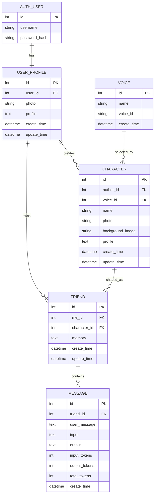

# AiFriends 数据库 ER 图与数据关系详解

> 这份文档解决一个新手最常见的问题：**Model 文件我每一行都认识，但我不知道这些表为什么这样连。**

AiFriends 当前核心关系可以先记成一句话：

> 一个真实用户拥有一个 UserProfile；用户可以创建多个 Character，也可以与任意 Character 建立 Friend；Friend 保存这段关系的长期记忆，并拥有很多 Message；Character 选择一个 Voice；SystemPrompt 是独立的 AI 运行配置。

---

# 1. ER 图



`SystemPrompt` 没有外键，所以单独理解：

```text
SystemPrompt
├── title
├── order_number
├── prompt
├── create_time
└── update_time
```

---

# 2. Django Auth User 与 UserProfile

Django 已经自带：

```python
from django.contrib.auth.models import User
```

它负责认证需要的核心信息，例如：

```text
username
password hash
is_staff
is_superuser
```

AiFriends 没有把头像和个性简介硬塞进 Django User，而是新建：

```python
class UserProfile(models.Model):
    user = models.OneToOneField(User, ...)
    photo = models.ImageField(...)
    profile = models.TextField(...)
```

关系：

```text
User 1 ───── 1 UserProfile
```

## 为什么是 OneToOne？

因为一个认证账号只应该对应一份 AiFriends 用户资料。

你可以把它理解成：

```text
User        = 登录身份
UserProfile = 产品业务资料
```

### 查询练习

```python
profile = UserProfile.objects.get(user=request.user)
```

跨关系查询：

```python
UserProfile.objects.get(user__username='alice')
```

双下划线：

```text
user__username
```

意思是沿着 `user` 关系继续查询 User 的 `username` 字段。

---

# 3. UserProfile 与 Character

```text
UserProfile 1 ───── N Character
```

Character：

```python
class Character(models.Model):
    author = models.ForeignKey(UserProfile, ...)
```

一个用户可以创建很多角色：

```text
用户 Alice
├── Character: 小雨
├── Character: Luna
└── Character: 编程老师
```

每个 Character 只有一个 author。

## 为什么 author 不能直接相信前端传入？

创建角色时应该从：

```python
request.user
```

得到当前身份，再找到 UserProfile。

不要信任：

```json
{
  "author_id": 999
}
```

否则用户可能伪造别人的身份创建数据。

---

# 4. Voice 与 Character

```text
Voice 1 ───── N Character
```

一个 Voice 可以被多个 Character 选择。

```python
class Voice(models.Model):
    name = models.CharField(...)
    voice_id = models.CharField(...)
```

注意两个“id”概念：

```text
Voice.id       → AiFriends 数据库主键
Voice.voice_id → 第三方 TTS 服务识别的音色 ID
```

前端创建 Character 时通常传：

```text
voice_id = Voice.id
```

后端聊天 TTS 时真正使用：

```python
friend.character.voice.voice_id
```

也就是：

```text
Character
  ↓ ForeignKey
Voice row
  ↓
third-party voice_id
  ↓
TTS Service
```

---

# 5. Friend 是整个项目最重要的数据关系

```text
UserProfile 1 ── N Friend N ── 1 Character
```

Friend：

```python
class Friend(models.Model):
    me = models.ForeignKey(UserProfile, ...)
    character = models.ForeignKey(Character, ...)
    memory = models.TextField(...)
```

很多新手第一次会问：

> Character 已经存在了，为什么还需要 Friend？

因为 Character 与 Friend 表达的是两件不同的事情。

## Character 表示“AI 是谁”

例如：

```text
名字：Luna
人格：温柔的科幻小说作家
头像：...
声音：...
```

## Friend 表示“某个用户和这个 AI 的关系”

例如：

```text
用户 A ↔ Luna
memory: 用户 A 喜欢喝茶

用户 B ↔ Luna
memory: 用户 B 正在准备高考
```

如果把 memory 放 Character：

```text
所有用户会共享同一份记忆
```

显然不正确。

所以：

```text
Character.profile = AI 固定人格
Friend.memory      = 对某个用户的长期关系记忆
```

这是理解 AiFriends 数据设计最关键的一点之一。

---

# 6. Friend 与 Message

```text
Friend 1 ───── N Message
```

每一次完整问答保存一条 Message：

```python
class Message(models.Model):
    friend = models.ForeignKey(Friend, ...)
    user_message = models.TextField(...)
    input = models.TextField(...)
    output = models.TextField(...)
    input_tokens = models.IntegerField(...)
    output_tokens = models.IntegerField(...)
    total_tokens = models.IntegerField(...)
```

注意：一条数据库 Message 表示：

```text
User question + AI answer
```

前端 UI 通常把它拆成两个气泡：

```text
Message row
├── user_message → user bubble
└── output       → ai bubble
```

---

# 7. `Message.input` 和 `user_message` 为什么同时存在？

`user_message`：

```text
用户这一轮真正输入的原始文本
```

`input`：

```text
模型调用时实际输入的 messages 序列化快照
```

它可能包含：

```text
SystemPrompt
Character Profile
Long-term Memory
Recent Messages
Current HumanMessage
```

因此 `input` 更适合：

- Debug
- 审计模型到底看到了什么
- Token 分析

而 `user_message` 更适合：

- 展示聊天历史
- 业务查询

---

# 8. Token 字段为什么保存？

```text
input_tokens
output_tokens
total_tokens
```

这使未来可以做：

```text
用户成本统计
角色成本统计
每日 Token 使用
模型调用优化
异常调用检测
```

练习 SQL/ORM 思维：

> 如果以后想统计某个 Friend 总共消耗多少 token，你会在哪张表聚合？

答案：Message。

---

# 9. SystemPrompt 为什么没有 ForeignKey？

当前模型：

```python
class SystemPrompt(models.Model):
    title = models.CharField(...)
    order_number = models.IntegerField(...)
    prompt = models.TextField(...)
```

代码通过：

```python
SystemPrompt.objects.filter(
    title='回复'
).order_by('order_number')
```

或者：

```python
SystemPrompt.objects.filter(
    title='记忆'
)
```

读取。

它现在是一种**全局运行配置表**。

### 优点

不用改代码就能在 Admin 调整 Prompt。

### 当前限制

它还没有：

```text
按用户
按 Character
按模型
按版本
```

做更细粒度关联。

这是很好的二次开发方向。

---

# 10. 删除时会发生什么？`on_delete=models.CASCADE`

多个关系使用：

```python
on_delete=models.CASCADE
```

意思是上游对象删除后，下游依赖对象也会被数据库关系清理。

例如概念上：

```text
删除 Friend
  ↓
该 Friend 的 Message 一起删除
```

```text
删除 Character
  ↓
与它关联的 Friend 可能一起删除
  ↓
Friend 的 Message 再一起删除
```

## 新手必须做的思考

Cascade 很方便，但生产系统删除数据前要慎重。

问自己：

- 用户误删 Character，要不要把多年聊天历史也永久删除？
- 是否需要软删除？
- 是否需要归档？
- 是否需要数据库备份？

当前项目适合学习，但这些是从 Demo 走向生产必须考虑的问题。

---

# 11. 当前关系中值得改进的约束

## 11.1 Friend 唯一性

逻辑上通常希望：

```text
(me, character)
```

唯一。

现在应用层会先查再创建，但可以进一步研究数据库：

```python
models.UniqueConstraint(
    fields=['me', 'character'],
    name='unique_friend_relationship',
)
```

为什么数据库约束仍有价值？

因为并发请求下：

```text
请求 A：没查到
请求 B：也没查到
请求 A：create
请求 B：create
```

只靠“先查后建”仍可能产生竞态。

---

## 11.2 Message 长度

当前：

```text
user_message max_length 500
output max_length 500
input max_length 10000
```

而模型回答可能超过 500 字符。

当前代码在保存时也会主动截断。

这是一个需要明确的产品选择：

```text
数据库只存摘要/截断结果？
还是完整保存？
```

不要在不知道的情况下随意调大字段，而应先明确用途与成本。

---

# 12. RAG 数据为什么没画进 SQLite ER 图？

知识库当前使用：

```text
LanceDB
```

而不是 Django SQLite Model。

所以系统数据实际上分成两类：

```text
关系业务数据
→ SQLite / Django ORM

向量知识数据
→ LanceDB
```

此外还有：

```text
media 图片文件
第三方 LLM/ASR/TTS 服务
```

完整系统不是“一切都在 db.sqlite3”。

---

# 13. 数据存储全景

```text
AiFriends
│
├── SQLite
│   ├── Django User
│   ├── UserProfile
│   ├── Voice
│   ├── Character
│   ├── Friend
│   ├── Message
│   └── SystemPrompt
│
├── media/
│   ├── 用户头像
│   ├── Character 头像
│   └── Character 背景图
│
├── LanceDB
│   ├── 文本 chunk
│   └── Embedding vector
│
└── 外部服务
    ├── LLM
    ├── Embedding API
    ├── ASR
    └── TTS
```

---

# 14. ORM 练习题

尝试不看答案写查询。

## Q1：获取当前用户所有 Character

目标：

```text
Character.author.user == request.user
```

## Q2：获取当前用户所有 Friend

目标：

```text
Friend.me.user == request.user
```

## Q3：获取某 Friend 最新 10 条 Message

目标：

```text
按 -id 排序，切片 10 条
```

## Q4：获取 Character 作者用户名

关系：

```text
Character.author.user.username
```

## Q5：获取一个 Friend 使用的 TTS voice id

关系链：

```text
Friend
  → character
  → voice
  → voice_id
```

对应 Python 对象访问：

```python
friend.character.voice.voice_id
```

如果你能在脑中沿这些 ForeignKey 走通，后端代码会突然变得容易很多。

---

# 15. 推荐阅读源码

```text
backend/web/models/user.py
backend/web/models/character.py
backend/web/models/friend.py
backend/web/admin.py
backend/web/migrations/
```

配合：

```bash
python manage.py shell
```

亲手执行 ORM 查询，比只读 ER 图有效得多。
