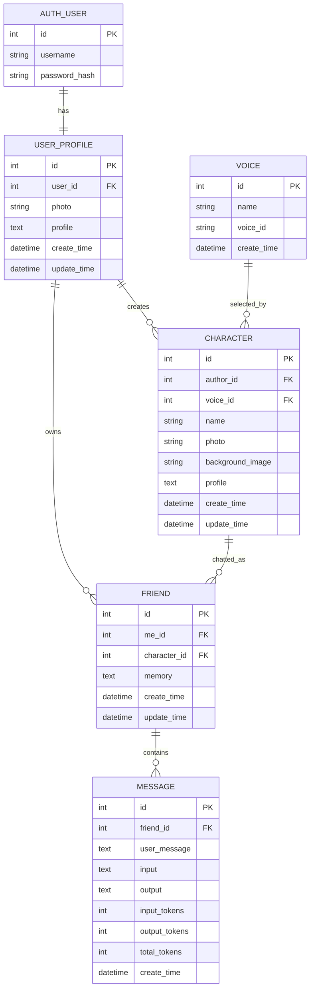

# AiFriends 数据库 ER 图与数据关系详解

🌐 **语言 / Language：** **简体中文** | [English](./DATABASE_ER_EN.md)

> 这份文档解决一个新手最常见的问题：**Model 文件每一行都认识，但不知道这些表为什么这样连。**

AiFriends 当前核心关系可以先记成一句话：

> 一个真实用户拥有一个 UserProfile；用户可以创建多个 Character，也可以与任意 Character 建立 Friend；Friend 保存这段关系的长期记忆，并拥有很多 Message；Character 可以选择 Voice；SystemPrompt 是独立的 AI 运行配置；RAG 向量数据存放在 LanceDB，而不是 SQLite。

---

# 1. ER 图



`SystemPrompt` 当前没有外键，所以单独理解：

```text
SystemPrompt
├── title
├── order_number
├── prompt
├── create_time
└── update_time
```

---

# 2. Django Auth User 与 UserProfile

Django 已经自带：

```python
from django.contrib.auth.models import User
```

它负责认证相关信息，例如：

```text
username
password hash
is_staff
is_superuser
```

AiFriends 把产品业务资料放进单独的：

```python
class UserProfile(models.Model):
    user = models.OneToOneField(User, ...)
    photo = models.ImageField(...)
    profile = models.TextField(...)
```

关系：

```text
User 1 ───── 1 UserProfile
```

可以理解成：

```text
User        = 登录身份
UserProfile = 产品业务资料
```

查询练习：

```python
profile = UserProfile.objects.get(user=request.user)
UserProfile.objects.get(user__username='alice')
```

`user__username` 表示沿 `user` 关系继续查询 Django User 的 `username`。

---

# 3. UserProfile 与 Character

```text
UserProfile 1 ───── N Character
```

一个用户可以创建多个 Character，每个 Character 只有一个 author。

创建角色时 author 应从：

```python
request.user
```

得到当前登录身份，再找到 UserProfile。

不要信任前端传入：

```json
{
  "author_id": 999
}
```

否则用户可能伪造别人的身份创建数据。

---

# 4. Voice 与 Character

```text
Voice 1 ───── N Character
```

注意两个 ID：

```text
Voice.id       → AiFriends 数据库主键
Voice.voice_id → 第三方 TTS 服务识别的音色 ID
```

TTS 时概念链路：

```text
Friend
  ↓
Character
  ↓
Voice
  ↓
voice_id
  ↓
TTS Service
```

当前工程化实现中 TTS 是可选能力；关闭 TTS 时，没有有效 Voice 也不应阻断纯文本聊天。

---

# 5. Friend 是整个项目最重要的数据关系

```text
UserProfile 1 ── N Friend N ── 1 Character
```

Friend：

```python
class Friend(models.Model):
    me = models.ForeignKey(UserProfile, ...)
    character = models.ForeignKey(Character, ...)
    memory = models.TextField(...)
```

## Character 表示“AI 是谁”

例如：

```text
名字：Luna
人格：温柔的科幻小说作家
头像：...
声音：...
```

## Friend 表示“某个用户和这个 AI 的关系”

```text
用户 A ↔ Luna
memory: 用户 A 喜欢喝茶

用户 B ↔ Luna
memory: 用户 B 正在准备考试
```

所以：

```text
Character.profile = AI 固定人格
Friend.memory      = 对某个用户的长期关系记忆
```

如果 memory 放在 Character 上，不同用户会错误地共享同一份长期记忆。

---

# 6. Friend 唯一性：当前已经是数据库真实约束

逻辑要求：

```text
一个 UserProfile + 一个 Character
最多只有一条 Friend
```

当前 `main` 已经实现：

```python
models.UniqueConstraint(
    fields=['me', 'character'],
    name='unique_friend_per_user_character',
)
```

因此这不再是“未来可以研究”的建议，而是当前数据模型的真实 invariant。

为什么还需要数据库约束？

因为只靠：

```text
先查询
没找到
再 create
```

在并发下仍可能发生：

```text
请求 A：没查到
请求 B：也没查到
请求 A：create
请求 B：create
```

当前迁移在添加 UniqueConstraint 之前还处理了历史重复关系：选择 canonical Friend、迁移依赖 Message、保留有价值的 memory、删除冗余行，然后再添加约束。

工程思维：

```text
应用层 get_or_create → 表达正常业务意图
数据库 UniqueConstraint → 最终完整性保证
Data Migration → 让历史数据满足新 invariant
```

---

# 7. Friend 与 Message

```text
Friend 1 ───── N Message
```

一条数据库 Message 表示一次完整问答：

```text
User question + AI answer
```

前端通常拆成两个气泡：

```text
Message row
├── user_message → user bubble
└── output       → ai bubble
```

当前模型字段包括：

```text
friend
user_message
input
output
input_tokens
output_tokens
total_tokens
create_time
```

---

# 8. `Message.input` 与 `user_message`

`user_message`：

```text
用户这一轮真正输入的原始文本
```

`input`：

```text
模型工作流实际输入的 messages 序列化快照
```

可能包含：

```text
SystemPrompt
Character Profile
Long-term Memory
Recent Messages
Current HumanMessage
```

因此 `input` 更适合 Debug / 审计上下文 / Token 分析；`user_message` 更适合聊天历史展示。

### 当前限制

聊天保存代码会对部分序列化输入/输出做长度截断，因此它不是完整的无限长度 forensic archive。这是当前实现边界，未来需要根据产品、隐私和成本决定是否改成完整持久化或独立审计存储。

---

# 9. Token 字段为什么保存？

```text
input_tokens
output_tokens
total_tokens
```

未来可以用于：

```text
用户成本统计
Character / Friend 成本统计
模型优化
异常调用检测
Token / latency dashboard
```

如果要统计某个 Friend 总 Token，用 Message 做聚合。

---

# 10. SystemPrompt 为什么没有 ForeignKey？

当前 `SystemPrompt` 是一种全局运行配置表：

```text
title
order_number
prompt
```

例如：

```text
title='回复'
title='记忆'
```

### 优点

不用修改 Python 源码就能通过 Admin 调整 Prompt。

### 当前限制

还没有完整支持：

```text
按用户
按 Character
按模型
按版本
```

这是未来 Prompt Management 的工程方向。

---

# 11. `on_delete=models.CASCADE`

多个关系使用 CASCADE。

概念上：

```text
删除 Friend
  ↓
该 Friend 的 Message 一起删除
```

```text
删除 Character
  ↓
相关 Friend 可能删除
  ↓
Friend 的 Message 再删除
```

从 Demo 走向生产必须继续考虑：

```text
软删除
归档
备份恢复
误删除
隐私删除请求
media 文件清理
LanceDB 数据清理
```

数据库级 CASCADE 应与产品的数据生命周期设计一致。

---

# 12. 当前 Message 长度与截断设计

当前模型大致限制：

```text
Friend.memory        5000
Message.user_message 500
Message.input        10000
Message.output       500
```

模型回答可能超过这些范围，而聊天保存代码还会主动截断部分内容。

需要明确产品选择：

```text
只保存有界诊断快照？
还是完整保存聊天和 Prompt？
是否需要独立审计存储？
```

不要只因为“字段不够大”就随意调大，而应一起考虑成本、隐私、migration 和查询需求。

---

# 13. RAG 为什么不在 SQLite ER 图？

知识库当前使用：

```text
LanceDB
```

所以系统数据至少分成：

```text
关系业务数据
→ SQLite / Django ORM

向量知识数据
→ LanceDB

图片文件
→ media/

外部推理
→ LLM / Embedding / ASR / TTS Provider
```

完整系统不是“一切都在 db.sqlite3”。

---

# 14. 数据存储全景

```text
AiFriends
│
├── SQLite
│   ├── Django User
│   ├── UserProfile
│   ├── Voice
│   ├── Character
│   ├── Friend
│   ├── Message
│   └── SystemPrompt
│
├── media/
│   ├── 用户头像
│   ├── Character 头像
│   └── Character 背景图
│
├── LanceDB
│   ├── 文本 chunk
│   ├── metadata/source
│   └── Embedding vector
│
└── 外部服务
    ├── LLM
    ├── Embedding API
    ├── ASR
    └── TTS
```

---

# 15. RAG Source 与隐私

当前 retrieval helper 会规范化来源标签，避免把服务器绝对路径作为 citation 暴露出去。

更合适：

```text
data.txt
```

而不是：

```text
/home/private/server/.../data.txt
```

这说明 metadata 也属于安全与隐私边界。

---

# 16. Structured Memory 是未来 Schema 方向

当前：

```text
Friend.memory = 自由文本摘要
```

未来可以设计：

```text
category
value
source_message_id
timestamp
confidence
status
```

获得：

```text
来源追踪
冲突处理
选择性删除
敏感信息策略
可评测性
```

但它也需要谨慎处理现有 free-text memory 的 migration，不适合一次性“直接改字段”。

---

# 17. ORM 练习

## Q1：当前用户所有 Character

```text
Character.author.user == request.user
```

## Q2：当前用户所有 Friend

```text
Friend.me.user == request.user
```

## Q3：某 Friend 最新 10 条 Message

```text
filter friend
order_by('-id')
[:10]
```

如果加入模型上下文，通常再恢复旧→新的时间顺序。

## Q4：Character 作者用户名

```text
Character.author.user.username
```

## Q5：一个 Friend 的 TTS voice id

```text
Friend
  → character
  → voice
  → voice_id
```

Python：

```python
friend.character.voice.voice_id
```

注意 Voice 可为空/语音可关闭时，工程代码必须显式处理 null / text-only fallback。

---

# 18. 推荐阅读源码

```text
backend/web/models/user.py
backend/web/models/character.py
backend/web/models/friend.py
backend/web/admin.py
backend/web/migrations/
```

配合：

```bash
cd backend
python manage.py shell
```

亲手执行 ORM 查询，比只读 ER 图更容易建立数据关系直觉。

---

## 最终心智模型

```text
Django User
  ↓ 1:1
UserProfile
  ├→ owns Character ─→ Voice
  └→ owns Friend ←── Character
            ↓
          Message

Friend.memory
  → user-specific long-term relationship memory

SystemPrompt
  → global prompt configuration

LanceDB
  → vector knowledge outside SQLite
```

如果能解释每条关系为什么存在、由谁拥有、删除时发生什么、并发时由谁保证 invariant，就真正读懂了 AiFriends 的数据库设计。
