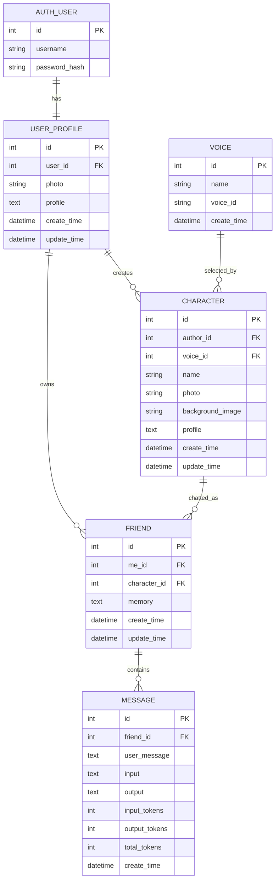

# AiFriends Database ER Guide and Data Relationships

🌐 **Language:** [简体中文](./DATABASE_ER.md) | **English**

> This guide answers a common beginner problem: **“I can read every Model line, but I do not understand why these tables are connected this way.”**

The core relationship can be summarized as:

> One Django User has one `UserProfile`. A profile can create many `Character` rows and can also form a `Friend` relationship with Characters. `Friend` stores user-specific long-term memory and owns many `Message` rows. A Character can select a `Voice`. `SystemPrompt` is independent runtime prompt configuration. RAG vector data lives outside SQLite in LanceDB.

---

# 1. ER Diagram



`SystemPrompt` has no foreign key in the current model, so treat it separately:

```text
SystemPrompt
├── title
├── order_number
├── prompt
├── create_time
└── update_time
```

---

# 2. Django Auth User and UserProfile

Django provides:

```python
from django.contrib.auth.models import User
```

It owns authentication-oriented fields such as:

```text
username
password hash
is_staff
is_superuser
```

AiFriends keeps product-specific profile data in a separate model:

```python
class UserProfile(models.Model):
    user = models.OneToOneField(User, ...)
    photo = models.ImageField(...)
    profile = models.TextField(...)
```

Relationship:

```text
User 1 ───── 1 UserProfile
```

A useful mental split:

```text
User        = authentication identity
UserProfile = AiFriends product profile
```

### Query practice

```python
profile = UserProfile.objects.get(user=request.user)
```

Cross-relation lookup:

```python
UserProfile.objects.get(user__username='alice')
```

The double underscore means:

```text
follow relation `user`
then filter User.username
```

---

# 3. UserProfile and Character

```text
UserProfile 1 ───── N Character
```

A Character has an author relation:

```python
class Character(models.Model):
    author = models.ForeignKey(UserProfile, ...)
```

One user profile can create many AI Characters.

### Why the server must derive `author`

When creating a Character, use authenticated identity:

```python
request.user
```

then resolve the corresponding `UserProfile`.

Do not trust a browser claim such as:

```json
{
  "author_id": 999
}
```

Authentication defines who the caller is.

---

# 4. Voice and Character

```text
Voice 1 ───── N Character
```

A Voice stores both an AiFriends database ID and a provider-specific identifier:

```text
Voice.id       → local primary key
Voice.voice_id → ID understood by the external TTS provider
```

A Character stores the relation to the local Voice row.

At TTS time the application follows:

```text
Friend
  ↓
Character
  ↓
Voice
  ↓
voice_id
  ↓
TTS provider
```

### Important current behavior

TTS is optional. The maintained chat path can run text-only when TTS is disabled, and a missing Voice should not make text chat impossible when speech is not required. `Character.voice` uses `on_delete=SET_NULL`: retiring/deleting a Voice clears the Character voice reference instead of cascade-deleting user-authored Characters, Friends, or Message history.

---

# 5. Friend Is the Most Important Relationship Model

```text
UserProfile 1 ── N Friend N ── 1 Character
```

Current model concept:

```python
class Friend(models.Model):
    me = models.ForeignKey(UserProfile, ...)
    character = models.ForeignKey(Character, ...)
    memory = models.TextField(...)
```

Why not chat directly against Character only?

Because these are different concepts.

## Character = “Who is the AI?”

Example:

```text
name: Luna
persona: gentle science-fiction writer
avatar: ...
voice: ...
```

## Friend = “What is the relationship between this user and this AI?”

Example:

```text
User A ↔ Luna
memory: User A likes tea

User B ↔ Luna
memory: User B is preparing for an exam
```

Therefore:

```text
Character.profile = stable/shared character identity
Friend.memory      = user-specific relationship memory
```

Putting `memory` directly on Character would incorrectly share one user's remembered facts with every other user of the same Character.

---

# 6. Friend Uniqueness Is a Real Database Invariant

Current `main` enforces:

```python
models.UniqueConstraint(
    fields=['me', 'character'],
    name='unique_friend_per_user_character',
)
```

So the intended invariant is:

```text
one UserProfile + one Character → at most one Friend
```

This is stronger than only doing:

```text
filter first
create if missing
```

because two concurrent requests can both observe “missing” before either one writes.

The migration that added the constraint also had to clean historical duplicates safely before applying the new invariant.

### Engineering lesson

```text
application check → friendly intent / normal path
database constraint → final integrity guarantee
migration strategy → make old data compatible with the new invariant
```

---

# 7. Friend and Message

```text
Friend 1 ───── N Message
```

A persisted Message represents one user/AI exchange:

```python
class Message(models.Model):
    friend = models.ForeignKey(Friend, ...)
    user_message = models.TextField(...)
    input = models.TextField(...)
    output = models.TextField(...)
    input_tokens = models.IntegerField(...)
    output_tokens = models.IntegerField(...)
    total_tokens = models.IntegerField(...)
```

The frontend usually renders one database row as two bubbles:

```text
Message row
├── user_message → user bubble
└── output       → AI bubble
```

---

# 8. Why Both `Message.user_message` and `Message.input` Exist

`user_message` is the user's direct text for this turn.

`input` is intended as a snapshot of what was sent into the model workflow, which may include:

```text
SystemPrompt
Character profile
Friend.memory
recent Message history
current HumanMessage
```

This makes `input` potentially useful for:

- debugging;
- audit/repro of model context;
- token/cost analysis;
- understanding why the model answered a certain way.

### Current caution

The chat persistence code currently serializes/truncates some fields before storage. Long responses/context can therefore be truncated. Treat this as an explicit engineering limitation, not a guarantee of complete forensic history.

---

# 9. Why Persist Token Fields

```text
input_tokens
output_tokens
total_tokens
```

These enable future analysis such as:

```text
cost by user
cost by Character
cost by Friend
model optimization
abnormal-usage detection
latency/token dashboards
```

ORM exercise:

> If you want total token usage for one Friend, which table should you aggregate?

Answer: `Message`.

---

# 10. SystemPrompt as Global Runtime Configuration

Current model:

```python
class SystemPrompt(models.Model):
    title = models.CharField(...)
    order_number = models.IntegerField(...)
    prompt = models.TextField(...)
```

The app queries groups such as:

```text
title='回复'  → reply/system behavior
title='记忆'  → memory update behavior
```

with `order_number` providing ordering where needed.

### Benefit

Prompt behavior can be edited in Django Admin without modifying Python code.

### Current limitation

There is not yet a full prompt-versioning/ownership model for:

```text
per user
per Character
per provider/model
per deployment/version
```

That is a useful future design exercise.

---

# 11. Cascade Deletion

Several relationships use:

```python
on_delete=models.CASCADE
```

Conceptually:

```text
Delete Friend
  ↓
its Message rows are deleted
```

and depending on the relation chain:

```text
Delete Character
  ↓
related Friend rows may be deleted
  ↓
those Friends' Message rows are deleted
```

### Product/privacy questions

Before using cascade deletion in a production product, decide:

- should years of chat history disappear when a Character is deleted?
- do you need soft delete?
- archive/export?
- restore/backup?
- deletion audit?
- media cleanup?
- vector-store cleanup?

The database behavior should match an intentional lifecycle policy.

---

# 12. Message Length and Truncation

Current model limits include:

```text
Friend.memory   max_length 5000
Message.user_message max_length 500
Message.input   max_length 10000
Message.output  max_length 500
```

The chat code also truncates persisted serialized content.

This creates an explicit design question:

```text
Do we store full prompts/answers?
Do we store only bounded diagnostic snapshots?
Should chat display/history use a different storage model?
```

Do not simply increase field sizes without deciding purpose, privacy, cost, and migration impact.

---

# 13. Why RAG Data Is Not in the SQLite ER Diagram

RAG currently uses:

```text
LanceDB
```

rather than Django ORM models.

The system therefore has multiple data stores:

```text
relational product data
→ SQLite / Django ORM

vector knowledge data
→ LanceDB

image/media files
→ media/

external inference
→ LLM / Embedding / ASR / TTS providers
```

A full system model is larger than `db.sqlite3`.

---

# 14. Storage Overview

```text
AiFriends
│
├── SQLite
│   ├── Django User
│   ├── UserProfile
│   ├── Voice
│   ├── Character
│   ├── Friend
│   ├── Message
│   └── SystemPrompt
│
├── media/
│   ├── user avatars
│   ├── Character avatars
│   └── Character backgrounds
│
├── LanceDB
│   ├── text chunks
│   ├── metadata/source
│   └── embedding vectors
│
└── external services
    ├── Chat LLM
    ├── Embedding API
    ├── ASR
    └── TTS
```

---

# 15. RAG Source Metadata and Privacy

Retrieval source labels should identify evidence without leaking deployment paths.

Current retrieval helpers normalize source values so the Agent/evaluation sees a safe label such as:

```text
data.txt
```

instead of:

```text
/home/private/server/repo/backend/web/documents/data.txt
```

This is a small but real example of data-model metadata becoming a security/privacy concern.

---

# 16. Structured Memory as a Future Schema

Current:

```text
Friend.memory = free-text summary
```

A future design may model memory items with fields such as:

```text
category
value
source_message_id
timestamp
confidence
status
```

This could support:

- provenance;
- conflict handling;
- selective deletion;
- policy around sensitive memory;
- evaluation.

It would also require a careful migration from existing free-text memory, so it should not be introduced casually.

---

# 17. ORM Exercises

## Q1: Current user's Characters

Target relation:

```text
Character.author.user == request.user
```

## Q2: Current user's Friends

```text
Friend.me.user == request.user
```

## Q3: Latest 10 Messages for one Friend

```text
filter by friend
order by -id
slice 10
```

Then reverse in memory if you need oldest-to-newest model context.

## Q4: Character author's username

```text
Character.author.user.username
```

## Q5: TTS provider voice ID for one Friend

```text
Friend
  → character
  → voice
  → voice_id
```

Python object traversal:

```python
friend.character.voice.voice_id
```

Remember: Voice may be optional for text-only operation, so production-quality code should handle nullability intentionally.

---

# 18. Source Files to Read

```text
backend/web/models/user.py
backend/web/models/character.py
backend/web/models/friend.py
backend/web/admin.py
backend/web/migrations/
```

Useful shell workflow:

```bash
cd backend
python manage.py shell
```

Type real ORM queries. An ER diagram becomes much easier to understand when you traverse the relations yourself.

---

## Final mental model

```text
Django User
  ↓ 1:1
UserProfile
  ├→ owns Character ─→ selects Voice
  └→ owns Friend ←── Character
            ↓
          Message
            ↓
   short-term chat history

Friend.memory
  → long-term relationship summary

SystemPrompt
  → global prompt configuration

LanceDB
  → vector knowledge outside relational DB
```

If you can explain why each relationship exists and what data boundary it creates, you are ready to reason about authorization, memory, migrations, and RAG at the system level.
