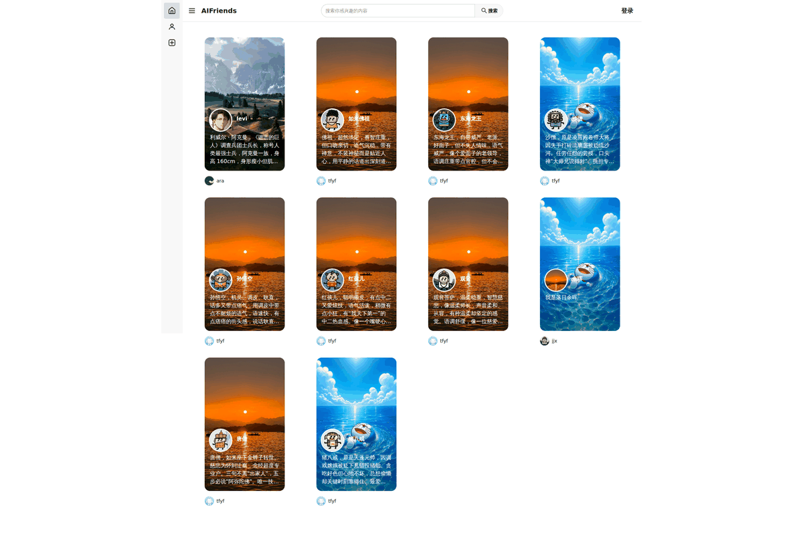
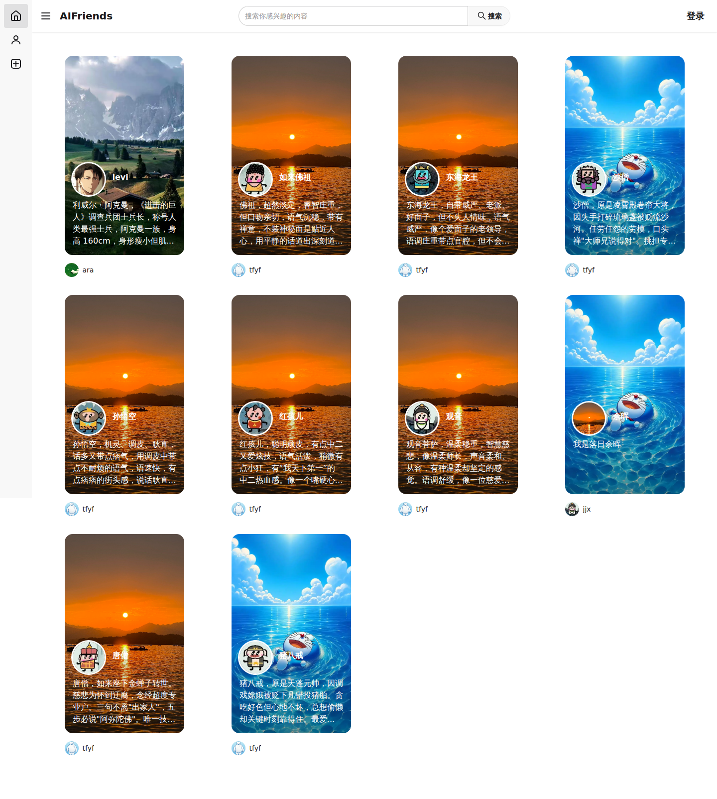
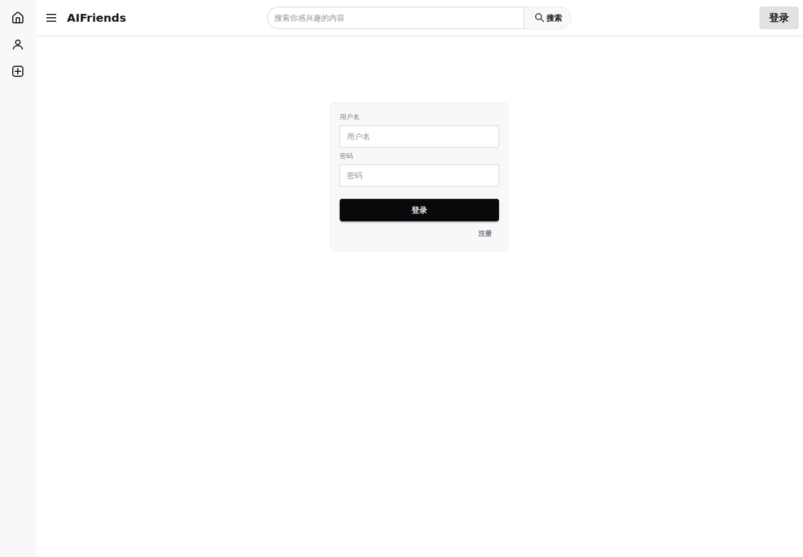
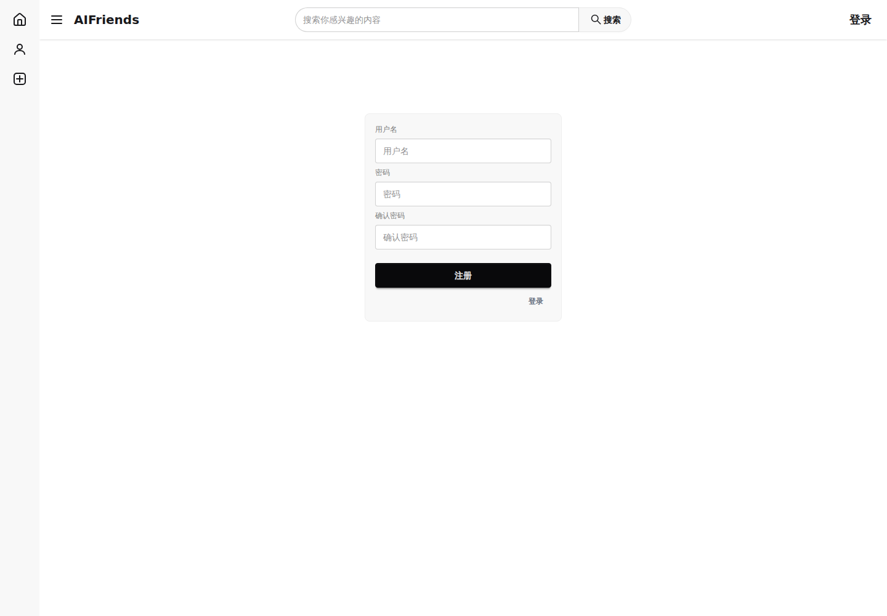
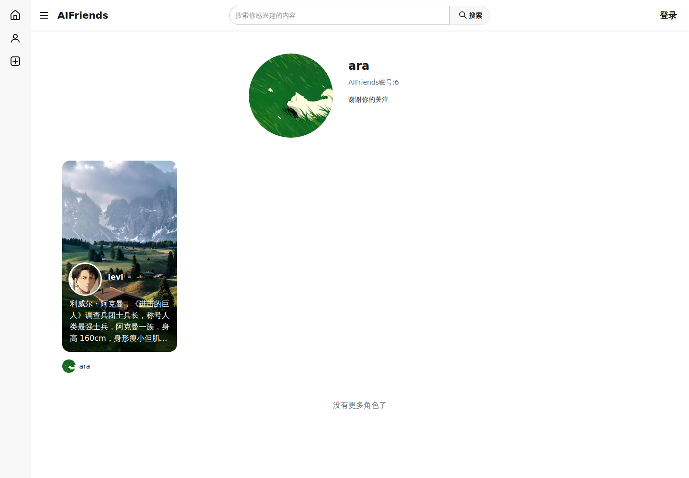

# AiFriends Live Demo Verification / 在线体验验证

🌐 **Live deployment / 实际部署：** <https://app8056.acapp.acwing.com.cn/>

This document records how the real screenshots in this repository were obtained and what they do — and do not — prove. / 本文记录仓库中真实线上截图的采集方式，以及这些证据能够证明和不能证明什么。

Related / 相关：

- [Product Experience / 实际产品体验](./PRODUCT_EXPERIENCE.md)
- [Screenshots & GIF Guide / 截图与 GIF 指南](./SCREENSHOTS.md)
- [Bilingual Engineering Glossary / 双语工程术语表](./BILINGUAL_GLOSSARY.md)
- [Browser E2E / 浏览器端到端验证](../e2e/README.md)

## Evidence model / 证据模型

AiFriends deliberately separates four kinds of product evidence so the README does not turn “implemented in source” into “personally observed in production.” / AiFriends 刻意区分四类产品证据，避免把“源码已经实现”误写成“生产环境已经亲测”。

| Evidence | Meaning / 含义 |
|---|---|
| **Production observed** | Seen on the real public deployment / 已在真实公网部署中观察 |
| **Browser E2E verified** | Executed through real Chromium + Vue + API + Django + SQLite / 真实 Chromium 跨前后端与数据库执行通过 |
| **Source implemented** | Present in maintained `main` source code / 当前维护版源码已有明确实现 |
| **Config-dependent** | Requires runtime LLM/RAG/ASR/TTS provider or feature flags / 是否可用取决于部署时的模型、Provider 与功能开关 |

The production screenshots below are **Production observed** evidence. The repository Browser E2E is separate evidence for authenticated maintained behavior and must not be presented as a production screenshot. RAG, ASR and TTS can be implemented in source while still depending on the deployment configuration. / 下面的线上截图属于 **Production observed**；仓库 Browser E2E 是另一类登录态维护版证据，不能伪装成生产截图；RAG、ASR、TTS 即使源码已有实现，也仍可能取决于具体部署配置。

## Production verification / 生产环境验证方式

On **2026-08-11**, a GitHub-hosted `ubuntu-24.04` runner used **Playwright 1.55 + Chromium 140** to visit the production deployment from an independent public network.

2026-08-11，项目使用 GitHub-hosted `ubuntu-24.04` runner，通过 **Playwright 1.55 + Chromium 140** 从独立公网环境访问真实线上部署。

The run was intentionally read-only / 本次体验刻意保持只读：

- no test account registration / 未注册测试账号；
- no Character creation / 未创建角色；
- no Friend creation or chat messages / 未创建 Friend 或发送聊天消息；
- no production-data mutation / 未修改生产数据。

## Verified production routes / 已验证生产页面

| Route | HTTP | Observation / 实际观察 |
|---|---:|---|
| `/` | 200 | Public Character discovery / 公开角色发现 |
| `/user/account/login` | 200 | Login form / 登录表单 |
| `/user/account/register` | 200 | Registration form / 注册表单 |
| `/user/space/6` | 200 | Public user space and Character content / 公开用户空间与角色内容 |

These observations support claims such as “the deployed application exposes a public Character-discovery experience and public creator spaces.” They do **not** by themselves prove that every authenticated, LLM, RAG or speech feature was enabled during that production visit. / 这些证据可以支持“线上部署确实存在公开 Character 发现与创作者空间”等描述，但不能单凭这些截图推导出当时生产环境已经开启所有登录态、LLM、RAG 或语音能力。

## Authenticated maintained behavior / 登录态维护版行为

The repository also contains a Browser E2E flow that performs a real registration and protected-route journey against the maintained application in an isolated `AI_MODE=mock` environment:

仓库另有 Browser E2E，在隔离的 `AI_MODE=mock` 环境里执行真实登录态链路：

```text
Chromium registration form
        ↓
Vite / Vue
        ↓
/api proxy
        ↓
Django / DRF
        ↓
temporary SQLite
        ↓
protected /friend
        ↓
page reload
        ↓
refresh-token auth restoration
```

This is **Browser E2E verified** evidence, not a production screenshot. It proves that the maintained frontend/backend authentication path works end to end without requiring external AI credentials. See [Browser E2E](../e2e/README.md). / 这是 **Browser E2E verified**，不是生产环境截图；它用于证明维护版的浏览器、前端、认证 API 与数据库链路能够端到端工作，而且不依赖外部 AI Key。

## Real walkthrough GIF / 真实截图浏览 GIF



This GIF is built reproducibly from the four real screenshots below by `scripts/build_demo_gif.py`. It is a visual gallery rather than a claim that one recorded browser session performed all four actions. / 该 GIF 由下面四张真实截图可复现地合成，是视觉浏览动图，不表示同一段录屏完成了全部交互。

## Real production screenshots / 真实生产截图

### Homepage / 首页



### Login / 登录



### Register / 注册



### Public user space / 公开用户空间



## Product claims beyond the screenshots / 截图之外的功能描述

For a complete user-oriented walkthrough — Character discovery, Friend continuity, Character-specific chat, creation/editing, streaming/cancellation, Memory, Tools, RAG and Voice — see [Product Experience](./PRODUCT_EXPERIENCE.md).

完整的用户视角产品路径（Character 发现、Friend 持续关系、角色专属聊天、角色创建/维护、Streaming/Cancellation、Memory、Tools、RAG、Voice）见 [Product Experience / 实际产品体验](./PRODUCT_EXPERIENCE.md)。其中每类能力都会标明它属于生产观察、Browser E2E、源码实现还是运行配置依赖。

## Scope note / 范围说明

These images are point-in-time production snapshots, not generated mockups. Public Characters, profile text, images, and deployed frontend assets can change after capture.

这些图片是某一时刻的真实线上快照，不是生成图或设计稿。公开角色、用户资料、图片和线上部署版本之后都可能变化。

Rebuild/verify the GIF / 重新生成或检查 GIF：

```bash
python scripts/build_demo_gif.py
python scripts/build_demo_gif.py --check
```
